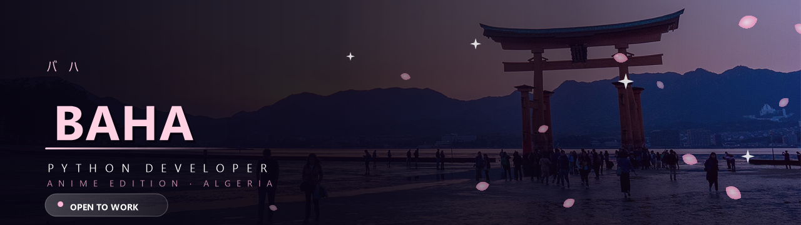
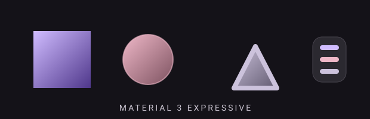
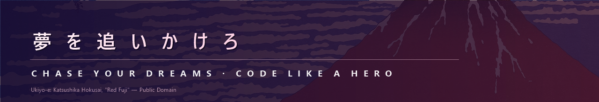

# 

  

 

  
  
  
  
  

---

## ✨ About

> *"Turning ideas into clean, working software — one commit at a time."*

- 🔭 Currently exploring **Python automation & backend engineering**
- 🌱 Deep-diving into **software architecture & scalable design**
- 🎨 Passionate about **Material 3 / Material 3 Expressive design systems**
- 💼 Open to freelance and collaborative opportunities
- 🧠 Ask me about **Python, automation, APIs, and problem solving**
- 🎯 2026 Goal: **Ship real products that solve real problems**
- ⚡ Fun fact: **I turn coffee into code & bugs into features**

 

  

 

## 🧩 Developer Card

  

 

## ⛩️ Anime Corner

> *"Training arcs are just long refactor sprints with better animation."*

|  |  |
| :--- | :--- |
| 🍥 **All-time favourites** | One Piece · Naruto · Demon Slayer · Attack on Titan · Jujutsu Kaisen · Frieren |
| 🔥 **On repeat right now** | Solo Leveling · Chainsaw Man · Blue Lock |
| 💭 **Favourite trope** | The underdog who trains in silence and returns unstoppable |
| ⚔️ **Spirit animal** | The quiet strategist — wins with preparation, not noise |
| 🎧 **Coding soundtrack** | Anime openings, city pop & lo-fi |

 

## 🛠️ Tech Arsenal

  

  
  
  
  
  
  
  

 

## 📦 Featured Work

| Project | Description | Stack |
| :--- | :--- | :--- |
| 🔢 Quantum-Credit-Master 🔒 | Python-based virtual card generator using the Luhn algorithm for validation, BIN analysis and batch generation. | Python |
| 🤖 boottraderrr1 🔒 | Python automation project. | Python |
| 💈 Barberly 🔒 | A stylish barber service website. | HTML |
| 🎨 [m3e-canvas](https://github.com/bahadjdz/m3e-canvas) | Sketch Material 3 Expressive screens in the browser — contributed AI-draft continuation features (upstream PR #413). | TypeScript |

> 🔒 = private repository — walkthrough available on request.

 

## 🧊 3D Contribution City

  

 

## 📊 Stats

  
  

  

  

 

## 📈 Language Breakdown

  
  

 

## 🐍 Contribution Snake

  

---

## 📬 Connect

 

> ⭐ **"Code is poetry written in logic."**

 

## 📜 Artwork & Credits

| Asset | Source | License |
| :--- | :--- | :--- |
| Hero background photo | *After Sunset at the Torii Gate, Miyajima* — Ajay Suresh, via Wikimedia Commons | CC BY 2.0 |
| Banner ukiyo-e print | *Red Fuji* (Thirty-six Views of Mount Fuji) — Katsushika Hokusai, via Wikimedia Commons | Public Domain |
| Card & banner icons | [Iconify](https://iconify.design) — Hugeicons, Font Awesome Free, Simple Icons, Material Design Icons | MIT · CC BY 4.0 · CC0 · Apache-2.0 |
| Vector scenes & animation | Hand-authored SVG in this repository | Same as this repository |

 

