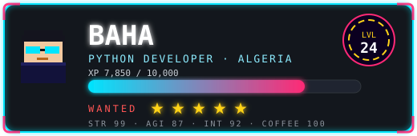
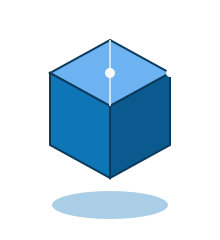

# 

  
  
  
  

 

  

  

---

## 📜 Character Lore

  

> *"Turning ideas into clean, working software — one commit at a time."*

- 🔭 Currently exploring **Python automation & backend engineering**
- 🌱 Deep-diving into **software architecture & scalable design**
- 💼 Open to freelance and collaborative opportunities
- 🧠 Ask me about **Python, automation, APIs, and problem solving**
- 🎯 2026 Goal: **Ship real products that solve real problems**
- ⚡ Fun fact: **I turn coffee into code & bugs into features**

 

## 🛠️ Tech Arsenal

  

  
  
  
  
  
  
  

 

## 🎯 Mission Log

| 🎯 MISSION | 📝 BRIEFING | 🛠️ LOADOUT |
| :---: | :--- | :--- |
| 🔢 Quantum-Credit-Master 🔒 | Python-based virtual card generator using the Luhn algorithm for validation, BIN analysis and batch generation. | 🐍 Python |
| 🤖 boottraderrr1 🔒 | Python automation project. | 🐍 Python |
| 💈 Barberly 🔒 | A stylish barber service website. | 🌐 HTML |
| 🎨 [m3e-canvas](https://github.com/bahadjdz/m3e-canvas) | Sketch Material 3 Expressive screens in the browser — contributed AI-draft continuation features (upstream PR #413). | ⚛️ TypeScript |

> 🔒 = locked mission (private repo) — walkthrough available on request.

 

## 🧊 3D Contribution City

  
   
  

 

## 📊 Player Stats

  
  

  

  

 

## 🐍 Snake Mini-Game

  

 

## 📈 Mission Timeline

  

---

## 📡 Join My Lobby

 

> ⭐ **"Code is poetry written in logic."**

 

